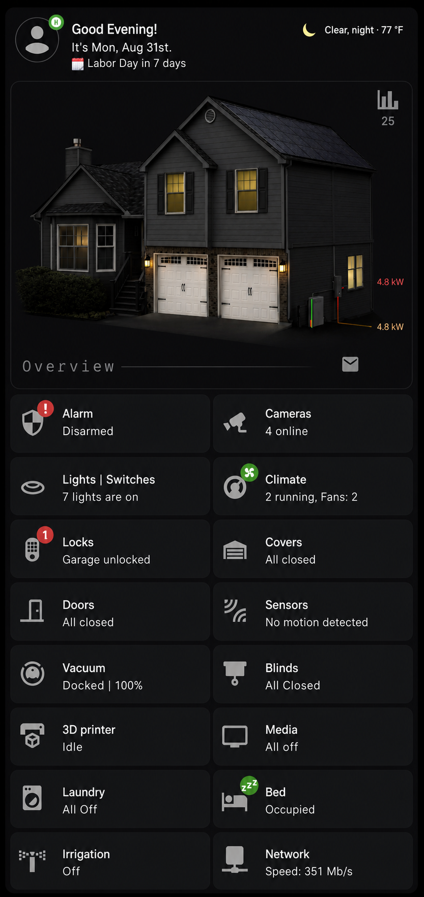

# Home Assistant Dashboard

A custom Home Assistant dashboard featuring security, energy, climate, media, home visualization, notifications, and more.

## Dashboard Preview

## About

This repository contains a sanitized, share-ready version of my Home Assistant Overview dashboard.

The dashboard combines an animated home visualization with live energy flow information and compact status cards for major Home Assistant systems.

Individual sections are also provided so you can use only the parts you want instead of installing the entire dashboard.

## Features

- Animated home and garage visualization
- Solar, battery, grid, and home energy flow
- Alarm and camera status
- Lights and switches
- Climate and fan status
- Locks and garage covers
- Door, motion, leak, smoke, and CO sensors
- Vacuum and blinds
- 3D printer status
- Media status
- Laundry status
- Bed occupancy
- Irrigation status
- Network speed
- Holiday countdown
- Notification indicators

## Start Here

### Complete Overview Dashboard

`overview-dashboard/dashboard.yaml`

Contains the complete Overview page including the home visualization and all horizontal-stack status rows.

### Individual Sections

`sections/`

Contains individual dashboard sections that can be copied separately.

`sections/overview-horizontal-stacks.yaml`

Contains all eight Overview status rows together.

### Backend Templates and Sensors

`backend/`

Contains the template sensors and binary sensors used by the dashboard, including:

- Dashboard status sensors
- Energy flow sensors
- Energy visualization sensors
- Supporting dashboard sensors

### User Setup

See:

`docs/USER-SETUP.md`

This explains the Home Assistant helpers and other items that users need to create themselves.

## Custom House Images and Garage GIFs

The house visualization shown in the screenshot uses images and animated GIFs created specifically for my home.

**Those files are not included in this repository.**

Users should create their own house images, garage-door animations, and other `/local/` assets.

The included `sensor.housecard` template provides states such as:

- `g1_opening`
- `g2_opening`
- `g1_closing`
- `g2_closing`
- `both_open`
- `g1_open_g2_closed`
- `g2_open_g1_closed`
- `both_closed`

These states can be mapped to your own images or animations.

See `docs/USER-SETUP.md` for more information.

## Home Assistant Helpers

Several dashboard features use helpers that were created through the Home Assistant UI.

Users should create their own equivalents for:

- `counter.notification`
- `counter.mailbox`
- `counter.trash_counter`
- `input_boolean.visitor`
- `input_boolean.lawn`

These can be created from:

**Settings → Devices & services → Helpers**

The automations or logic used to control these helpers can be customized for your own Home Assistant installation.

## Important Placeholders

Before using the dashboard, replace or map placeholders such as:

- `YOUR_HOME_ASSISTANT_USERNAME`
- `/YOUR_DASHBOARD_PATH/...`
- `weather.home`
- `alarm_control_panel.home_alarm`
- `sensor.your_3d_printer_current_stage`
- `sensor.your_3d_printer_remaining_time`
- `media_player.tv_1`, `media_player.tv_2`, etc.
- `/local/profile_primary.png`
- `/local/profile_default.png`

You will also need to replace device entities such as lights, locks, covers, climate devices, TVs, sensors, and energy entities with those from your own Home Assistant installation.

## Requirements

See:

`docs/REQUIREMENTS.md`

for the custom frontend cards and other dashboard requirements.

## Entity Mapping

See:

`docs/BACKEND-ENTITY-MAPPING.md`

for information about the template sensors and the entities they depend on.

## Notes

This dashboard is intended as a starting point rather than a drop-in configuration for every Home Assistant installation.

Entity names, devices, integrations, images, and automations will differ between homes. The included files show the structure and logic used to build the dashboard while allowing users to adapt it to their own setup.
